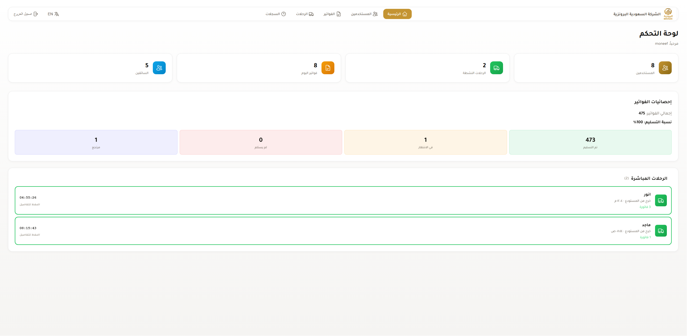
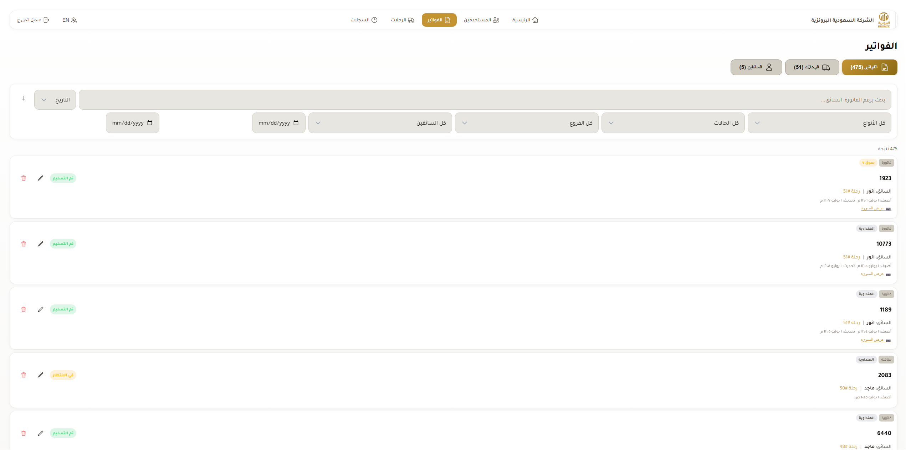
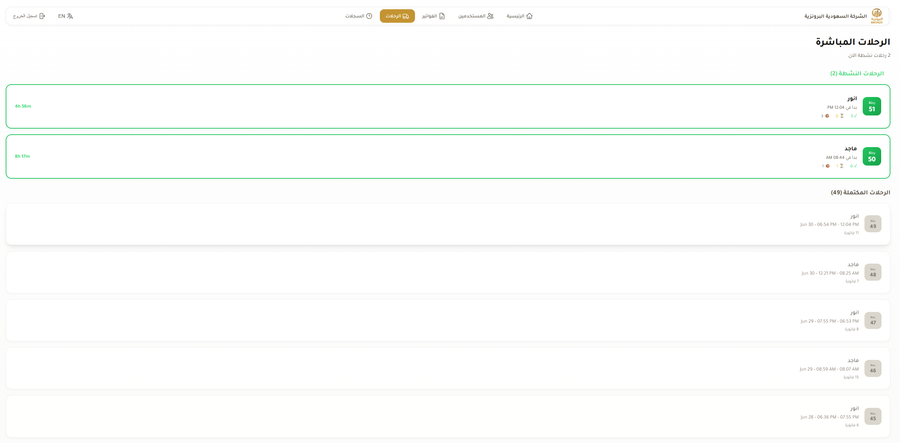
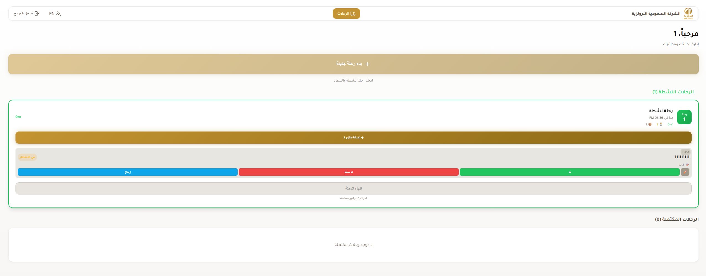

# 🚚 Delivery Tracking System

A full-stack **shipment tracking and invoice management system** built for a construction tools distribution company. This Progressive Web App (PWA) enables real-time coordination between admins, sellers, and delivery drivers — streamlining the entire process from invoice creation to delivery confirmation with photo proof.

---

## 📋 The Problem It Solves

In construction tools distribution, managing shipment deliveries across multiple branches is complex. Traditional paper-based tracking and manual phone coordination leads to:

- **Lost or delayed invoices** with no visibility into delivery status
- **No proof of delivery**, causing disputes between drivers, sellers, and customers
- **Inefficient route management** — drivers have no centralized system to track their active deliveries
- **No audit trail** — managers can't trace what happened to a specific shipment

This system digitizes the entire workflow with role-based access, real-time status tracking, timed deliveries, and camera-captured delivery proof — all accessible from mobile devices in the field.

---

## ✨ Key Features

- **Role-Based Access Control** — Three distinct roles (Admin, Seller, Driver) with tailored dashboards and permissions
- **Invoice Lifecycle Management** — Create, assign, track, and close invoices with status tracking (Pending → Delivered / Not Received / Returned)
- **Multi-Branch Support** — Manage deliveries across multiple warehouse and retail branches
- **Real-Time Delivery Timer** — Track how long each delivery takes from dispatch to confirmation
- **Photo Proof of Delivery** — Drivers capture delivery photos directly through the camera (no gallery uploads) with automatic 30-day expiration
- **Trip Management** — Group invoices into driver trips for organized route management
- **Activity Logging** — Full audit trail of all system actions (creates, updates, status changes, reassignments)
- **Auto-Cleanup** — Scheduled Cloud Functions automatically delete old invoices, trips, and images after 30 days
- **Bilingual UI** — Full Arabic (RTL) and English support with dynamic language switching
- **Progressive Web App** — Installable on mobile devices with offline Firestore persistence
- **Responsive Design** — Mobile-first design that works seamlessly on phones, tablets, and desktops

---

## 🛠️ Tech Stack

| Layer | Technology |
|-------|-----------|
| **Frontend Framework** | [Next.js 16](https://nextjs.org/) (App Router) |
| **Language** | TypeScript |
| **UI/Styling** | Tailwind CSS 4 + Custom CSS Design System |
| **Authentication** | Firebase Authentication (Email/Password) |
| **Database** | Cloud Firestore (NoSQL, real-time) |
| **File Storage** | Firebase Cloud Storage |
| **Backend Functions** | Firebase Cloud Functions (Node.js 20) |
| **Hosting/Deployment** | Firebase Hosting + Vercel |
| **PWA** | next-pwa with Service Worker |
| **State Management** | React Context API with data caching |

---

## 📸 Screenshots

> *Below are screenshots of the different views in the application, highlighting the user flow from login to delivery tracking.*

### Login Page


### Admin Dashboard


### Invoice Management


### Trips Tracking


### Driver View


---

## 🚀 Setup & Installation

### Prerequisites

- [Node.js](https://nodejs.org/) v18 or later
- A [Firebase](https://firebase.google.com/) project with Firestore, Authentication, Storage, and Cloud Functions enabled
- Firebase CLI installed globally: `npm install -g firebase-tools`

### 1. Clone the repository

```bash
git clone https://github.com/Moneef7/delivery-tracking-pwa.git
cd delivery-tracking-pwa
```

### 2. Install dependencies

```bash
# Install frontend dependencies
npm install

# Install Cloud Functions dependencies
cd functions
npm install
cd ..
```

### 3. Configure environment variables

Copy the example environment file and fill in your Firebase project credentials:

```bash
cp .env.example .env.local
```

Edit `.env.local` with your Firebase config values (found in Firebase Console → Project Settings → General → Your Apps → Web App):

```env
NEXT_PUBLIC_FIREBASE_API_KEY=your_api_key
NEXT_PUBLIC_FIREBASE_AUTH_DOMAIN=your_project.firebaseapp.com
NEXT_PUBLIC_FIREBASE_PROJECT_ID=your_project_id
NEXT_PUBLIC_FIREBASE_STORAGE_BUCKET=your_project.firebasestorage.app
NEXT_PUBLIC_FIREBASE_MESSAGING_SENDER_ID=your_sender_id
NEXT_PUBLIC_FIREBASE_APP_ID=your_app_id
NEXT_PUBLIC_FIREBASE_MEASUREMENT_ID=G-XXXXXXXXXX
```

### 4. Set up Firebase

```bash
# Login to Firebase
firebase login

# Initialize Firebase (select your project)
firebase use your-project-id

# Deploy Firestore rules and indexes
firebase deploy --only firestore

# Deploy Storage rules
firebase deploy --only storage

# Deploy Cloud Functions
firebase deploy --only functions
```

### 5. Create the first admin user

Place your Firebase service account key (downloaded from Firebase Console → Project Settings → Service Accounts) as `service-account-key.json` in the project root, then run:

```bash
node scripts/create-admin.js
```

> ⚠️ **Important:** Never commit `service-account-key.json` to version control. It is already included in `.gitignore`.

### 6. Run the development server

```bash
npm run dev
```

Open [http://localhost:3000](http://localhost:3000) in your browser.

---

## 📁 Project Structure

```
delivery-tracking-pwa/
├── src/
│   ├── app/              # Next.js App Router pages
│   │   ├── dashboard/    # Admin/Seller dashboard
│   │   ├── invoices/     # Invoice management (CRUD + status tracking)
│   │   ├── trips/        # Trip management with driver assignment
│   │   ├── users/        # User management (admin only)
│   │   ├── logs/         # Activity audit log
│   │   └── page.tsx      # Login page
│   ├── components/       # Reusable UI components
│   ├── contexts/         # React Context providers (Auth, Language, Cache)
│   └── lib/              # Firebase config, types, i18n translations
├── functions/            # Firebase Cloud Functions (auto-cleanup)
├── scripts/              # Admin setup scripts
├── public/               # Static assets, PWA manifest, icons
├── firestore.rules       # Firestore security rules
├── firestore.indexes.json # Firestore composite indexes
└── storage.rules         # Cloud Storage security rules
```

---

## 👨‍💻 About the Developer

Built by **Munef Mohsen AL-GAONI** — a full-stack developer passionate about building real-world business solutions with modern web technologies.

---

## 📄 License

This project is open source and available under the [MIT License](LICENSE).
